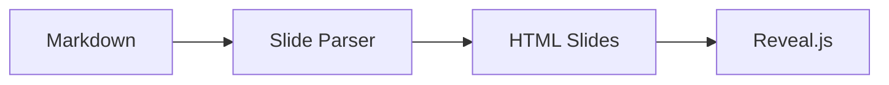

以下是一版 **MDPad 的 slide 支持最小实现方案（MVP）**。它的目标不是把 MDPad 做成 Slidev，而是让用户能在 **现有 Markdown 工作流里直接“演示当前文档”**，并且尽量复用你已经有的 Markdown / 数学公式 / Mermaid / 媒体能力。MDPad 现在本身就是 **Tauri + React + TipTap** 的单文档桌面编辑器，已经支持 math、Mermaid、图片/媒体、GFM table，以及一套 debounced markdown sync pipeline，所以最合理的做法是：**继续把 Markdown 当 source of truth，再加一个基于 reveal.js 的演示渲染层。** ([GitHub](https://raw.githubusercontent.com/endearqb/MDPad/main/README.md))

## 1\. 目标与边界

### 要做的

-   让任意 `.md` 文档可以进入 **Present / Slide Preview** 模式
    
-   用最少的新语法，把 Markdown 切成 slides
    
-   复用 MDPad 现有内容能力，尽量避免“编辑器里看起来对，演示里不对”
    

### 先不做的

-   不做 Slidev 那种完整 DSL
    
-   不做 Vue 组件嵌入
    
-   不做复杂布局编辑器、拖拽定位、动画面板
    
-   不做重型主题系统和插件生态
    

* * *

## 2\. 最小文档格式

### v1 规则

不新增新文件类型，仍然使用普通 `.md`。

#### 2.1 横向分页

用单独一行的 `---` 作为 **下一页 slide**：

```md
# MDPad
A lightweight Markdown editor

---

## Agenda

- Why
- How
- Demo

---

## Demo


```

#### 2.2 Speaker notes

用 `notes:` 开始备注区，放在当前 slide 末尾：

```md
## Agenda

- Why
- How
- Demo

notes:
开场先讲产品定位，再讲为什么不是 Slidev。
```

这个规则和 reveal.js 的 notes separator 默认行为是对齐的；它默认会匹配 `note:` / `notes:`。([reveal.js](https://revealjs.com/markdown/))

#### 2.3 在 slide 模式里，`---` 不再表示水平线

这是最小实现里最重要的一条约束：

-   **普通文档模式**：`---` 还是 Markdown horizontal rule
    
-   **演示模式**：`---` 解释为 slide separator
    
-   想在 slide 内画分隔线，先约定用：
    
    -   `***`
        
    -   或 `<hr />`
        

这样做的原因很简单：不用引入新 DSL，也不需要额外 frontmatter 支持。

#### 2.4 v1 不支持竖向 slides

reveal.js 支持 vertical slides，但最小版先不要上。官方 Markdown 分隔里，horizontal 和 vertical separator 是分开的。这个能力留到 v2，再约定 `--` 或 `----` 之类的二级分隔符。([reveal.js](https://revealjs.com/markdown/))

* * *

## 3\. 推荐的渲染架构

### 核心原则

**不要把 reveal.js 当成 Markdown 解析器。**  
**要把 reveal.js 当成“演示壳子 / 导航引擎”。**

原因是 reveal.js 的 Markdown 功能虽然现成，但更适合直接加载或解析通用 Markdown；而 MDPad 已经有自己的一套实际支持能力，包括 math、Mermaid、图片尺寸 hint、媒体标签等。为了减少语法漂移，最稳的方案是：

**Raw Markdown → MDPad slide compiler → 每页 HTML → reveal.js deck**

而不是：

**Raw Markdown → reveal Markdown plugin → deck**

reveal.js 确实提供 Markdown plugin 和分隔规则，也支持 npm 作为项目依赖；但它的 external markdown 场景本来就是按本地 web server / 外部 markdown 文件设计的，这不如你直接在应用内生成 sections 来得自然。([reveal.js](https://revealjs.com/installation/))

### 3.1 模块分层

```text
src/
  features/
    slides/
      parser/
        parseSlideMarkdown.ts
      renderer/
        renderSlideHtml.ts
      reveal/
        RevealDeck.tsx
        revealConfig.ts
      state/
        slideTypes.ts
      ui/
        PresentButton.tsx
        SlidePreviewPanel.tsx
        SlideToolbar.tsx
```

### 3.2 数据流

```text
Editor markdown text
  -> slide parser
  -> SlideDoc { slides[] }
  -> per-slide markdown
  -> existing MDPad markdown/html render pipeline
  -> slide html
  -> <section>...</section>
  -> Reveal.initialize(...)
```

### 3.3 关键数据结构

```ts
type SlideDoc = {
  slides: SlideItem[]
}

type SlideItem = {
  id: string
  index: number
  markdown: string
  html: string
  notes?: string
}
```

* * *

## 4\. 解析规则设计

### 4.1 切页规则

先做一个 **raw text parser**，不要依赖 TipTap document model：

1.  读当前文档 markdown 文本
    
2.  以“单独一行的 `---`”分割
    
3.  对每一页再找 `notes:` 块
    
4.  输出 `SlideItem[]`
    

伪规则：

```txt
slide separator:
^[ \t]*---[ \t]*$

notes start:
^[ \t]*notes:[ \t]*$
```

### 4.2 notes 规则

最简单实现：

-   只有在一页的最后一个 `notes:` 之后的内容才算 speaker notes
    
-   `notes:` 之前的内容是 slide body
    
-   `notes:` 之后内容不参与正文渲染，放进 `<aside class="notes">`
    

生成结果类似：

```html
<section>
  <div class="mdpad-slide-body">...</div>
  <aside class="notes">...</aside>
</section>
```

* * *

## 5\. reveal.js 集成方式

### 5.1 组件形态

做一个 `RevealDeck.tsx`，只接收编译后的 slides：

```tsx
<RevealDeck slides={slideDoc.slides} />
```

组件内部：

-   渲染 `<div class="reveal"><div class="slides">...`
    
-   每页一个 `<section>`
    
-   mount 后 `Reveal.initialize(config)`
    
-   内容变化时 `Reveal.sync()` 或销毁后重建
    

### 5.2 推荐 config（MVP）

reveal.js 有现成 config 项，最小版建议先开这些：

-   `embedded: true`：让 deck 更适合嵌在 MDPad 窗口里
    
-   `hash: true`：方便跳页与恢复
    
-   `slideNumber: true`
    
-   `controls: true`
    
-   `progress: true`
    
-   `transition: 'slide'`
    
-   `showNotes: false`
    

`embedded`、`showNotes`、PDF 相关配置都在 reveal.js 的官方配置里。([reveal.js](https://revealjs.com/config/))

示意：

```ts
const revealConfig = {
  embedded: true,
  hash: true,
  controls: true,
  progress: true,
  slideNumber: true,
  transition: 'slide',
  showNotes: false,
}
```

### 5.3 不用 external markdown loader

官方 external markdown 方案依赖 `data-markdown` 和 separator 配置，而且本地使用时需要跑 web server。你的桌面 app 已经拿到了当前文档文本，所以没必要走那条路。直接生成 `<section>` 更简单。([reveal.js](https://revealjs.com/markdown/))

* * *

## 6\. 内容渲染策略

### 6.1 优先复用 MDPad 自己的渲染链

这一步是成败关键。

MDPad 已经支持：

-   inline / block math
    
-   Mermaid
    
-   HTML media tags
    
-   image size hints
    
-   Obsidian-style image embeds
    
-   markdown roundtrip / sync pipeline ([GitHub](https://raw.githubusercontent.com/endearqb/MDPad/main/README.md))
    

所以每页内容不要重新发明一个 parser。建议：

-   从 raw markdown 切 slide
    
-   每页 markdown 交给 **现有 markdown -> html 渲染能力**
    
-   产出的 HTML 再塞进 reveal `<section>`
    

这样：

-   编辑器里能显示的，演示里大概率也能显示
    
-   未来修一个 Markdown 渲染 bug，可以同时惠及普通模式和 slide 模式
    

### 6.2 Mermaid

v1 有两个可选方案：

**方案 A：最小、最稳**

-   在 slide 渲染阶段识别 \`\`\`\`mermaid\` code block
    
-   和现有编辑器一样，渲染成 Mermaid 图
    
-   演示页只展示结果图，不开放编辑
    

**方案 B：延后**

-   v1 先把 Mermaid 当普通 code block
    
-   Phase 2 再补渲染
    

我建议直接上 A，因为 README 里 Mermaid 已经是你现有特色能力之一。([GitHub](https://raw.githubusercontent.com/endearqb/MDPad/main/README.md))

### 6.3 数学公式

沿用你现有 math 渲染逻辑。不要额外依赖 reveal 的 math markdown 解析路径，避免出现正文和演示表现不一致。

### 6.4 图片与附件路径

沿用现有 attachment / file path 解析逻辑。slide 模式里最容易翻车的是：

-   相对路径图片
    
-   粘贴进 attachment library 的资源
    
-   本地视频 / 音频
    

这块不要新写一套路径规则，直接复用文件层能力。

* * *

## 7\. UI 设计（最小版）

### 7.1 入口

先加两个入口就够了：

-   顶栏按钮：`Present`
    
-   快捷键：`F5` 或 `Ctrl+Alt+P`
    

### 7.2 展示方式

建议先做 **同窗口全屏预览层**，不要一开始就做独立窗口。

形态：

-   点击 `Present`
    
-   进入全屏或近全屏 overlay
    
-   左上角返回编辑
    
-   右上角简单工具栏：主题 / notes / print
    

原因：

-   工程量更小
    
-   keyboard focus 更容易控制
    
-   reveal 的 `embedded` 模式更适合这种嵌入式 deck ([reveal.js](https://revealjs.com/config/))
    

### 7.3 v1 工具栏

只保留：

-   Exit
    
-   Prev / Next
    
-   Theme（2~3 个）
    
-   Show notes（仅预览）
    
-   Print / Export PDF
    

* * *

## 8\. 导出方案

### 8.1 v1：先支持“打印为 PDF”

reveal.js 官方 PDF 导出本质上是带 `print-pdf` 参数打开 deck，然后走浏览器打印流程；notes 也可以通过 `showNotes` 配置打印出来。([reveal.js](https://revealjs.com/pdf-export/))

所以 MDPad 的最小版做法：

-   在 presentation route 上加“print mode”
    
-   点击 `Export PDF`
    
-   打开打印视图
    
-   调用系统打印 / print dialog
    
-   用户保存为 PDF
    

这比一开始就做真正的“无头 PDF 导出”稳得多。

### 8.2 v1.5：导出单文件 HTML

这个非常值：

-   方便分享
    
-   容易调试
    
-   不依赖本机安装环境
    

导出内容：

-   一个 `index.html`
    
-   内联样式 / reveal 资源
    
-   或一个目录式导出
    

* * *

## 9\. 分阶段开发清单

## Phase 0：技术验证

目标：证明 reveal.js 可以在 MDPad 内稳定跑起来。([reveal.js](https://revealjs.com/installation/))

任务：

-   引入 `reveal.js`
    
-   做一个硬编码 3 页 deck 的 React 组件
    
-   验证：
    
    -   键盘翻页
        
    -   焦点控制
        
    -   dark/light 下样式
        
    -   Tauri 窗口里展示正常
        

完成标准：

-   能从 React 页面稳定展示 deck
    
-   不出现明显焦点丢失 / 键盘失效
    

* * *

## Phase 1：文档切页 + 演示模式

目标：任意 Markdown 文档可进入 slide 模式。

任务：

-   实现 `parseSlideMarkdown.ts`
    
-   支持：
    
    -   `---` 分页
        
    -   `notes:` 备注
        
-   增加 `Present` 按钮
    
-   做 overlay 演示层
    
-   基础 reveal config
    

完成标准：

-   一个普通 `.md` 文件可直接播放
    
-   至少支持 10~20 页不卡顿
    
-   notes 能正确分离但默认不展示
    

* * *

## Phase 2：内容能力对齐

目标：让 slide 模式和正文模式尽量一致。MDPad 当前已经支持代码块、数学、Mermaid、媒体、图片尺寸等能力，这一阶段就是补齐演示侧表现。 ([GitHub](https://raw.githubusercontent.com/endearqb/MDPad/main/README.md))

任务：

-   复用 markdown -> html 渲染链
    
-   数学公式正确显示
    
-   Mermaid 正确显示
    
-   图片相对路径 / attachment 正确显示
    
-   code block 样式统一
    
-   基础主题适配
    

完成标准：

-   README 里已支持的主要内容类型，在 slides 里表现基本一致
    

* * *

## Phase 3：导出与体验完善

目标：让这个功能可真正交付使用。

任务：

-   `Export PDF`（先走 print workflow）
    
-   `Show Notes`
    
-   slide number / progress 开关
    
-   记住最近使用的 presentation theme
    
-   快捷键支持
    
-   e2e 测试：
    
    -   打开文档 -> Present
        
    -   翻页
        
    -   退出
        
    -   打印视图可打开
        

完成标准：

-   用户能把一份 Markdown 变成可演示、可打印的 deck
    

* * *

## 10\. 最小实现的风险点

### 风险 1：`---` 与 horizontal rule 冲突

解决：

-   明确规定只在 **Present 模式** 下把 `---` 当 slide separator
    
-   文档里说明：slide 内分隔线用 `***` 或 `<hr />`
    

### 风险 2：编辑器和演示渲染不一致

解决：

-   复用现有 markdown/html 渲染逻辑
    
-   reveal 只做容器与导航，不做主解析器
    

### 风险 3：Mermaid / 本地资源在演示模式失效

解决：

-   不新写资源解析规则
    
-   重用 attachment / 文件读取逻辑
    

### 风险 4：PDF 导出过早做复杂

解决：

-   第一版只做 print-to-PDF
    
-   真正程序化导出放后面
    

* * *

## 11\. 我建议你直接落地的版本

如果你要最短路径上线，我建议就按这版砍：

### 第一批上线功能

-   `Present` 按钮
    
-   `---` 分页
    
-   `notes:` speaker notes
    
-   reveal.js deck
    
-   数学 / 代码 / 图片可显示
    
-   print-to-PDF
    

### 第二批再做

-   Mermaid 完整渲染
    
-   主题切换
    
-   导出 HTML
    
-   竖向 slides
    
-   独立演示窗口
    

* * *

## 12\. 一个可直接写进文档的 MVP 规范

````md
# Slide 1 title
Subtitle

notes:
30 秒介绍 MDPad 的定位。

---

## Slide 2

- Keep Markdown as source of truth
- Reuse existing renderer
- Present with reveal.js

---

## Slide 3



规则：
- 单独一行 `---`：下一页
- `notes:`：当前页备注开始
- slide 模式里不用 `---` 画分隔线
- 仍然是普通 `.md`

---

## 13. 一句话版本

**MVP 的正确方向是：**
**“在 MDPad 里加一个 reveal.js 驱动的演示视图”，而不是“把 MDPad 变成 Slidev”。**

这样改动最小、最符合你现在的产品定位，也最容易验证用户到底会不会真的拿 MDPad 写 slides。

我可以下一条直接继续给你补一版 **更工程化的目录与接口草图**，包括 `parseSlideMarkdown.ts` 的规则、`RevealDeck.tsx` 的组件结构，以及每个阶段的验收标准。
::contentReference[oaicite:12]{index=12}
```