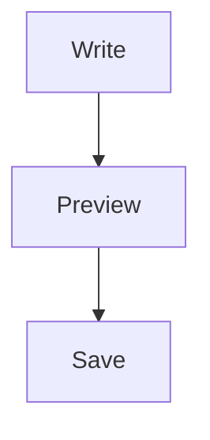

# MDPad Sample Document (English)

> This document is bundled with the installer to demonstrate supported formats.
>
> 中文版本: [打开中文示例](./MDPad-Sample.zh-CN.md)

## 0. In-Document TOC

### Syntax

````markdown
- [1. Headings and Text Styles](#1-headings-and-text-styles)
- [2. Lists and Tasks](#2-lists-and-tasks)
- [3. Links and Blockquote](#3-links-and-blockquote)
- [4. Callout](#4-callout)
````

### Rendered Result

- [1. Headings and Text Styles](#1-headings-and-text-styles)
- [2. Lists and Tasks](#2-lists-and-tasks)
- [3. Links and Blockquote](#3-links-and-blockquote)
- [4. Callout](#4-callout)

## 1. Headings and Text Styles

### Syntax

````markdown
# Heading 1
## Heading 2
### Heading 3
#### Heading 4

This is a paragraph with **bold**, *italic*, ***bold italic***, ~~strikethrough~~, ==highlight==, and `inline code`.

Strikethrough syntax only supports `~~text~~`, not `~text~`.
````

### Rendered Result

# Heading 1
## Heading 2
### Heading 3
#### Heading 4

This is a paragraph with **bold**, *italic*, ***bold italic***, ~~strikethrough~~, ==highlight==, and `inline code`.

Strikethrough syntax only supports `~~text~~`, not `~text~`.

## 2. Lists and Tasks

### Syntax

````markdown
Editor quick input: type `[] ` (or `[ ] `) then a space to create a task item.
When saved as Markdown, task syntax is normalized to `- [ ]` / `- [x]`.

- Bullet A
- Bullet B

1. Ordered 1
2. Ordered 2

- [x] Completed task
- [ ] Pending task
````

### Rendered Result

Editor quick input: type `[] ` (or `[ ] `) then a space to create a task item.  
When saved as Markdown, task syntax is normalized to `- [ ]` / `- [x]`.

- Bullet A
- Bullet B

1. Ordered 1
2. Ordered 2

- [x] Completed task
- [ ] Pending task

## 3. Links and Blockquote

### Syntax

````markdown
[Open GitHub](https://github.com/)

> This is a regular blockquote.
````

### Rendered Result

[Open GitHub](https://github.com/)

> This is a regular blockquote.

## 4. Callout

### Syntax

````markdown
> [!TIP]
> This is a TIP callout.

> [!WARNING]
> This is a WARNING callout.
````

### Rendered Result

> [!TIP]
> This is a TIP callout.

> [!WARNING]
> This is a WARNING callout.

## 5. Code Block

### Syntax

````markdown
```ts
function greet(name: string): string {
  return `Hello, ${name}`;
}
```
````

### Rendered Result

```ts
function greet(name: string): string {
  return `Hello, ${name}`;
}
```

## 6. Table

### Syntax

````markdown
| Feature | Status |
| --- | --- |
| Markdown | ✅ |
| Mermaid | ✅ |
| Math | ✅ |
````

### Rendered Result

| Feature | Status |
| --- | --- |
| Markdown | ✅ |
| Mermaid | ✅ |
| Math | ✅ |

## 7. Divider

### Syntax

````markdown
---
````

### Rendered Result

---

## 8. Math

### Syntax

````markdown
Inline: $E = mc^2$

Block:
$$
\int_0^1 x^2 \, dx = \frac{1}{3}
$$
````

### Rendered Result

Inline: $E = mc^2$

Block:
$$
\int_0^1 x^2 \, dx = \frac{1}{3}
$$

## 9. Mermaid

### Syntax

````markdown
Use standard fenced syntax: start with ` ```mermaid` and end with ` ``` `.


````

### Rendered Result


## 10. Image

### Syntax

````markdown

````

### Rendered Result


## 11. Video

### Syntax

````markdown
<video src="./media/sample-video.mp4" controls></video>
````

### Rendered Result

<video src="./media/sample-video.mp4" controls></video>

## 12. Audio

### Syntax

````markdown
<audio src="./media/sample-audio.mp3" controls></audio>
````

### Rendered Result

<audio src="./media/sample-audio.mp3" controls></audio>

---

If you want to keep editing this file long-term, use **Save As** to store it in your own documents folder.
