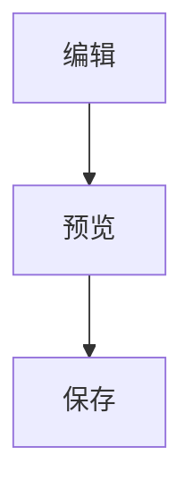

# MDPad 示例文档（中文）

> 这是安装包内置的功能演示文档。你可以在状态栏 `Saved/Unsaved` 右侧的 `?` 按钮再次打开它。
>
> English version: [Open English Sample](./MDPad-Sample.en-US.md)

## 0. 文档内目录（TOC）

### 语法

````markdown
- [1. 标题与文本样式](#1-标题与文本样式)
- [2. 列表与任务](#2-列表与任务)
- [3. 链接与引用](#3-链接与引用)
- [4. Callout](#4-callout)
````

### 渲染效果

- [1. 标题与文本样式](#1-标题与文本样式)
- [2. 列表与任务](#2-列表与任务)
- [3. 链接与引用](#3-链接与引用)
- [4. Callout](#4-callout)

## 1. 标题与文本样式

### 语法

````markdown
# 一级标题
## 二级标题
### 三级标题
#### 四级标题

这是普通段落，包含 **粗体**、*斜体*、***粗斜体***、~~删除线~~、==高亮== 与 `行内代码`。

删除线语法仅支持 `~~内容~~`，不支持 `~内容~`。
````

### 渲染效果

# 一级标题
## 二级标题
### 三级标题
#### 四级标题

这是普通段落，包含 **粗体**、*斜体*、***粗斜体***、~~删除线~~、==高亮== 与 `行内代码`。

删除线语法仅支持 `~~内容~~`，不支持 `~内容~`。

## 2. 列表与任务

### 语法

````markdown
编辑器快捷输入：`[] ` + 空格（或 `[ ] ` + 空格）可创建任务项。
保存到 Markdown 时，语法统一为 `- [ ]` / `- [x]`。

- 无序列表 A
- 无序列表 B

1. 有序列表 1
2. 有序列表 2

- [x] 已完成任务
- [ ] 待办任务
````

### 渲染效果

编辑器快捷输入：`[] ` + 空格（或 `[ ] ` + 空格）可创建任务项。  
保存到 Markdown 时，语法统一为 `- [ ]` / `- [x]`。

- 无序列表 A
- 无序列表 B

1. 有序列表 1
2. 有序列表 2

- [x] 已完成任务
- [ ] 待办任务

## 3. 链接与引用

### 语法

````markdown
[MDPad GitHub](https://github.com/)

> 这是普通引用。
````

### 渲染效果

[MDPad GitHub](https://github.com/)

> 这是普通引用。

## 4. Callout

### 语法

````markdown
> [!TIP]
> 这是 TIP Callout。

> [!WARNING]
> 这是 WARNING Callout。
````

### 渲染效果

> [!TIP]
> 这是 TIP Callout。

> [!WARNING]
> 这是 WARNING Callout。

## 5. 代码块

### 语法

````markdown
```ts
function greet(name: string): string {
  return `Hello, ${name}`;
}
```
````

### 渲染效果

```ts
function greet(name: string): string {
  return `Hello, ${name}`;
}
```

## 6. 表格

### 语法

````markdown
| 功能 | 状态 |
| --- | --- |
| Markdown | ✅ |
| Mermaid | ✅ |
| Math | ✅ |
````

### 渲染效果

| 功能 | 状态 |
| --- | --- |
| Markdown | ✅ |
| Mermaid | ✅ |
| Math | ✅ |

## 7. 分隔线

### 语法

````markdown
---
````

### 渲染效果

---

## 8. 公式

### 语法

````markdown
行内公式：$E = mc^2$

块级公式：
$$
\int_0^1 x^2 \, dx = \frac{1}{3}
$$
````

### 渲染效果

行内公式：$E = mc^2$

块级公式：
$$
\int_0^1 x^2 \, dx = \frac{1}{3}
$$

## 9. Mermaid

### 语法

````markdown
使用标准 fenced 语法：起始行为 ` ```mermaid`，结束行为 ` ``` `。


````

### 渲染效果


## 10. 图片

### 语法

````markdown

````

### 渲染效果


## 11. 视频

### 语法

````markdown
<video src="./media/sample-video.mp4" controls></video>
````

### 渲染效果

<video src="./media/sample-video.mp4" controls></video>

## 12. 音频

### 语法

````markdown
<audio src="./media/sample-audio.mp3" controls></audio>
````

### 渲染效果

<audio src="./media/sample-audio.mp3" controls></audio>

---

如果你准备长期编辑这份示例，建议使用 **Save As** 另存到你的文档目录。
